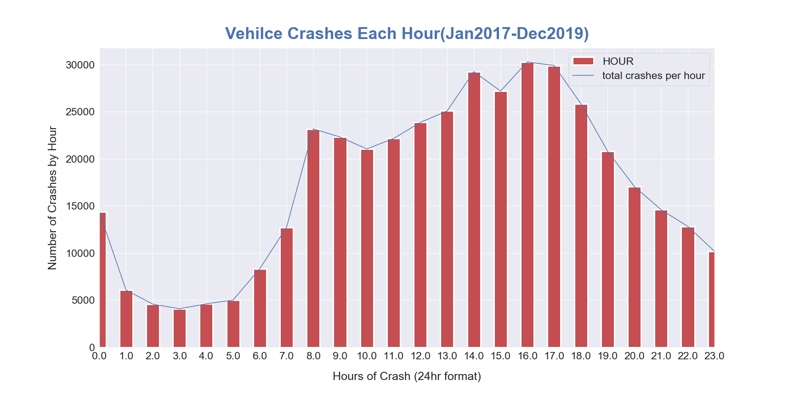
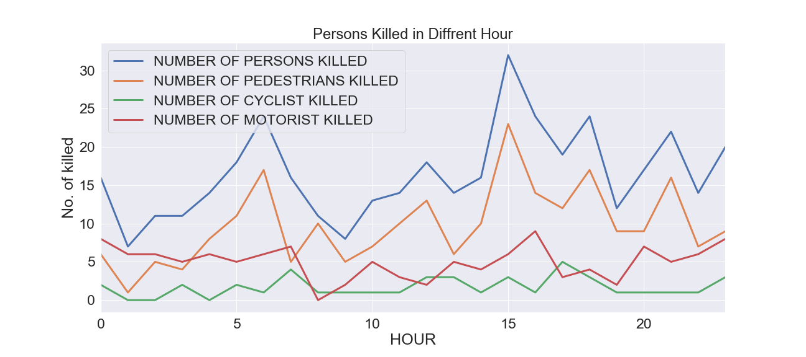
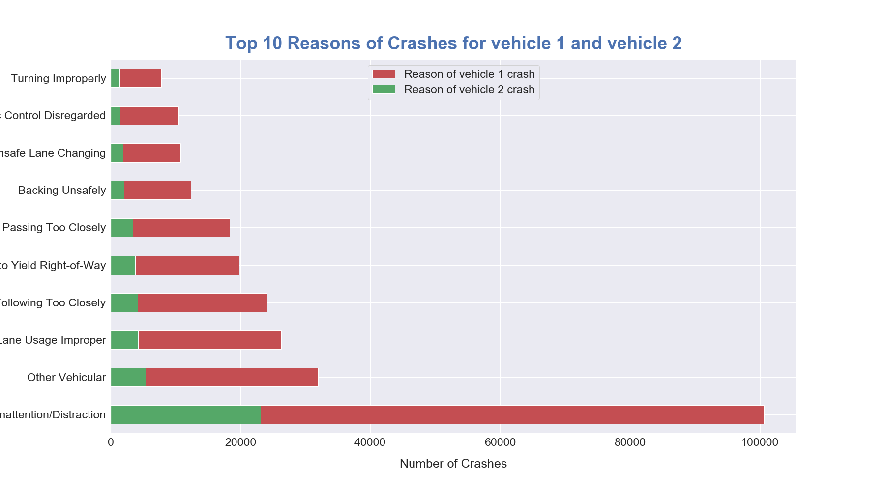
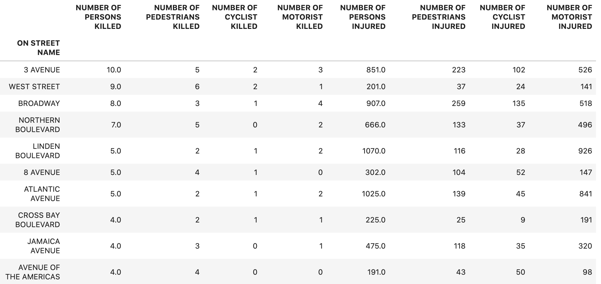
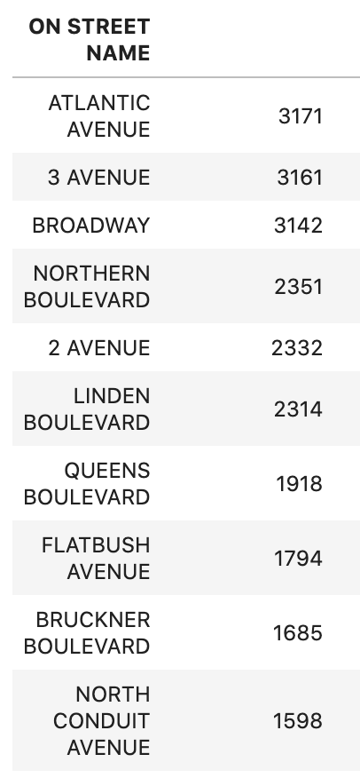

# Vehicle Crash in New York City :
# The details of  Hows, Whens  and Wheres 

Data for this project is avaialble on [NYC Open Data](https://data.cityofnewyork.us/Public-Safety/Motor-Vehicle-Collisions-Crashes/h9gi-nx95). Data was cleaned and modified for this project. 

# Motivation:
Have you ever been stuck  in traffic on LIE or BQE or BeltParkway or some other streets, blvds in NYC and wonder why, and why right now? Or do you wish that Elon Musk had already built a flying car, and  also you could afford it? Well, I have. Every time I get stuck in traffic,  the question always pop-ups in my head. More than that, every time before I  get into my car, I check google maps for green vs yellow or red color to see if I can avoid the traffic in some magical way. Unfortunately, I cannot: the green(even if there was)  color slowly/ or quickly turns yellow or red while I am driving. The same thing happens again. (flying cars and money to buy them) 
It has been my desire to find out the real truth of NYC traffic trend and look into details about it. So, I chose to analyze this particular dataset of NYC traffic of the past three years to understand the trend and statistics. Because I believe there is a solution for every problem, and getting the right/true information is one of the most important basic steps for moving to the right direction. I am attempting to mark the basic step in this project, so that further steps  can be trod on it. 
# Objective  
I am analysing 36 months of NYC City Vehicle crashes data ranging from January 2017 to December 2019. There are over 400 , 000 rows of data: 
I will be focusing mainly on the reasons for auto accidents to find out why and how crashes happen. Also whether the data suggest that there are  specific roads/streets to avoid because most crashes have been happening in a consistent manner. How different hours and months play a role in auto accidents was also investigated. 

# Process

The data was collected and recorded by NYPD (New York Police Department) in the process of safeguarding public safety and enforcing law and order. By law, the police  are required to record (MV104-AN) and report vehicle collisions in NYC where someone is injured or killed, or where there is at least $1000 or more financial loss; so the data meets the requirement of one or more of above. I downloaded the data from [NYC OpenData website.](https://data.cityofnewyork.us/Public-Safety/Motor-Vehicle-Collisions-Crashes/h9gi-nx95). I analyzed the data of vehicle crashes in NYC  that occured between the 3 years period of January 2017 to December 2019 . 

# Steps taken  for the project:
* Downloaded the data from NYC OpenData 
* Converted to dataframe from .csv, cleaned, and analyzed the data using Python Pandas and Jupyter notebook 
* Created bar charts of number of crashes vs different features.
* Created interactive heat maps  using folium for geo-location over the map of NYC 
* Plotted maps using matplotlib and pandas for specific hour, month, injury type
# When most accidents happen? 

The following figure shows that most accidents happen in evening rush hour around 5pm with second peak during morning rush hour around 9am. 

However, the total death of pedestrian, cyclist, motorists appears to be at highest around 7am and 3 pm. 

The high number of deadly accidents happen in the afternoon around 3:00 pm and around 7:00 am in the morning, which correlates to the time for school beginning and closing time. So, It might be directly related to school children/students related accidents. But for full confidence, more detail observation and analysis of data is needed. 

# How most accidents happen ? 

More than 32% accidents happened alone from Driver Inattention/Distraction and more than 84% accidents for main vehicle happened from 10 reasons including improperly passing or lane changing, following too closely, etc. with respective percentage of 
* [32.25, 10.25, 8.41, 7.73, 6.32, 5.86, 3.96, 3.45, 3.35, 2.5]

# Where fatal accidents happen most? 
Most people died in 3rd avenue followed by West st, and Broadway. The most dangerous places are given below: 

The data also shows that most accidents happen in Third Avenue, Broadway followed, and Atlantic Avenue are the top three places where crashes happen most. 

# Conclusion :
* Implement stricter rules (distracted driving: 32%, avoidable) 
* Explore areas to add more traffic personal, traffic light and traffic signs 
* Hi-way-(eg. LIE, BQE), airlift disabled vehicle !
# Future Directions
* Besides available data, a field survey of road conditions could have been more helpful
* Is airlifting disabled vehicle from highways possible? 
* May be flying cars !!!

